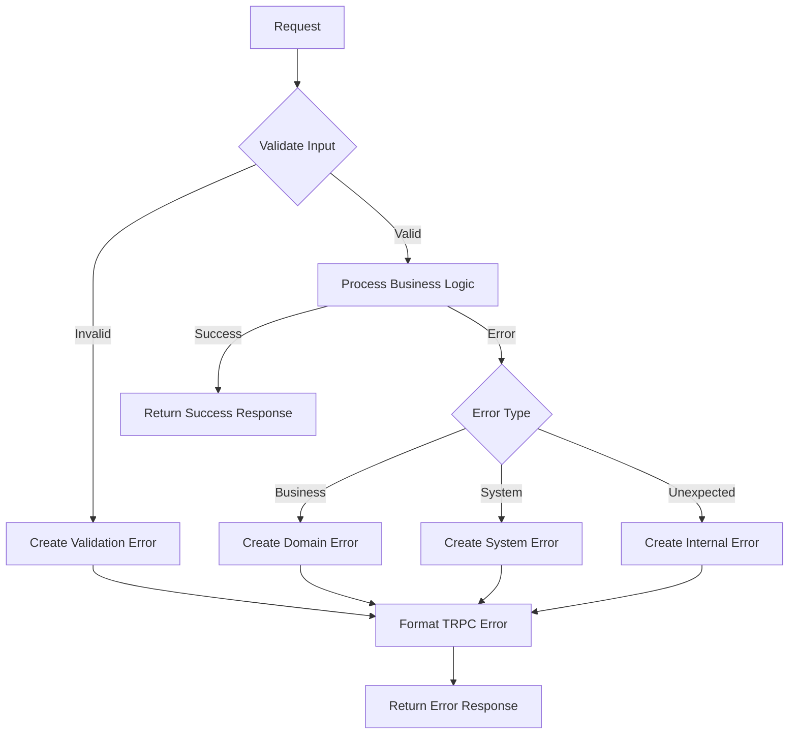

# 🚨 Error Handling Guide

## Tổng quan

Hệ thống error handling của Aloha được thiết kế để cung cấp trải nghiệm nhất quán và đáng tin cậy cho cả backend và frontend. Tài liệu này là cầu nối giữa backend và frontend để đảm bảo việc xử lý lỗi được thống nhất.

## 🏗️ Kiến trúc Error Handling

### 1. Cấu trúc Error Response

Tất cả API responses đều tuân theo format chuẩn:

```typescript
interface ApiResponse<T = any> {
    success: boolean;
    data?: T;
    error?: StandardizedError;
    meta?: {
        timestamp: string;
        requestId?: string;
        pagination?: {
            page: number;
            limit: number;
            total: number;
            totalPages: number;
        };
    };
}
```

### 2. Standardized Error Structure

```typescript
interface StandardizedError {
    code: ErrorCode; // Mã lỗi domain-specific
    message: string; // Thông điệp user-friendly
    details?: Record<string, any>; // Context bổ sung
    timestamp: string; // ISO timestamp
    requestId?: string; // ID để tracking
    originalError?: Error; // Error gốc (internal)
}
```

## 📋 Danh sách Error Codes

### Authentication Errors (AUTH\_\*)

| Code                            | HTTP Status | Message                                           | Description             |
| ------------------------------- | ----------- | ------------------------------------------------- | ----------------------- |
| `AUTH_INVALID_CREDENTIALS`      | 401         | Invalid email or password                         | Sai thông tin đăng nhập |
| `AUTH_TOKEN_EXPIRED`            | 401         | Your session has expired. Please log in again     | Token hết hạn           |
| `AUTH_TOKEN_INVALID`            | 401         | Invalid authentication token                      | Token không hợp lệ      |
| `AUTH_TOKEN_REVOKED`            | 401         | Your session has been revoked                     | Token bị thu hồi        |
| `AUTH_TOKEN_MISSING`            | 401         | Authentication token is required                  | Thiếu token             |
| `AUTH_INSUFFICIENT_PERMISSIONS` | 403         | You do not have permission to perform this action | Không đủ quyền          |
| `AUTH_USER_NOT_FOUND`           | 401         | User account not found                            | Tài khoản không tồn tại |

### User Management Errors (USER\_\*)

| Code                  | HTTP Status | Message                                          | Description                     |
| --------------------- | ----------- | ------------------------------------------------ | ------------------------------- |
| `USER_NOT_FOUND`      | 404         | User not found                                   | Người dùng không tồn tại        |
| `USER_ALREADY_EXISTS` | 400         | An account with this email already exists        | Email đã tồn tại                |
| `USER_INVALID_DATA`   | 400         | Invalid user data provided                       | Dữ liệu người dùng không hợp lệ |
| `USER_UPDATE_FAILED`  | 500         | Failed to update user information                | Cập nhật thất bại               |
| `USER_DELETE_FAILED`  | 500         | Failed to delete user account                    | Xóa thất bại                    |
| `USER_ACCESS_DENIED`  | 403         | You can only access your own account information | Không được phép truy cập        |

### Validation Errors (VALIDATION\_\*)

| Code                        | HTTP Status | Message                                    | Description          |
| --------------------------- | ----------- | ------------------------------------------ | -------------------- |
| `VALIDATION_REQUIRED`       | 400         | {field} is required                        | Trường bắt buộc      |
| `VALIDATION_INVALID_FORMAT` | 400         | {field} format is invalid                  | Format không hợp lệ  |
| `VALIDATION_TOO_LONG`       | 400         | {field} must be less than {max} characters | Quá dài              |
| `VALIDATION_TOO_SHORT`      | 400         | {field} must be at least {min} characters  | Quá ngắn             |
| `VALIDATION_INVALID_VALUE`  | 400         | {field} contains invalid characters        | Giá trị không hợp lệ |
| `VALIDATION_EMAIL_INVALID`  | 400         | Please enter a valid email address         | Email không hợp lệ   |
| `VALIDATION_PASSWORD_WEAK`  | 400         | Password must be at least 12 characters... | Mật khẩu yếu         |
| `VALIDATION_NAME_INVALID`   | 400         | Name must be 1-50 characters...            | Tên không hợp lệ     |

### System Errors (SYS\_\*)

| Code                         | HTTP Status | Message                                                  | Description           |
| ---------------------------- | ----------- | -------------------------------------------------------- | --------------------- |
| `SYS_INTERNAL_ERROR`         | 500         | An unexpected error occurred. Please try again later     | Lỗi hệ thống          |
| `SYS_DATABASE_ERROR`         | 500         | Database temporarily unavailable. Please try again later | Lỗi database          |
| `SYS_EXTERNAL_SERVICE_ERROR` | 500         | External service temporarily unavailable                 | Lỗi dịch vụ bên ngoài |
| `SYS_RATE_LIMIT_EXCEEDED`    | 429         | Too many requests. Please try again later                | Quá nhiều request     |
| `SYS_MAINTENANCE_MODE`       | 503         | System is currently under maintenance                    | Chế độ bảo trì        |

## 🔄 Error Flow

### Backend Processing



### Frontend Handling

```typescript
// Example: Handling API responses
async function apiCall() {
    try {
        const response = await api.request();

        if (!response.success) {
            handleApiError(response.error);
            return;
        }

        // Process successful response
        return response.data;
    } catch (error) {
        // Network or unexpected errors
        handleNetworkError(error);
    }
}

function handleApiError(error: StandardizedError) {
    switch (error.code) {
        case 'AUTH_INVALID_CREDENTIALS':
            showToast('Sai email hoặc mật khẩu', 'error');
            break;

        case 'USER_ALREADY_EXISTS':
            showToast('Email này đã được sử dụng', 'warning');
            break;

        case 'VALIDATION_EMAIL_INVALID':
            setFieldError('email', 'Email không hợp lệ');
            break;

        case 'SYS_DATABASE_ERROR':
            showToast('Hệ thống tạm thời không khả dụng. Vui lòng thử lại sau.', 'error');
            break;

        default:
            showToast('Có lỗi xảy ra. Vui lòng thử lại.', 'error');
            console.error('Unhandled error:', error);
    }
}
```

## 📝 Error Response Examples

### Success Response

```json
{
    "success": true,
    "data": {
        "id": "user123",
        "email": "user@example.com",
        "firstName": "John",
        "lastName": "Doe"
    },
    "meta": {
        "timestamp": "2026-02-04T10:30:00.000Z",
        "requestId": "req_abc123"
    }
}
```

### Authentication Error

```json
{
    "success": false,
    "error": {
        "code": "AUTH_INVALID_CREDENTIALS",
        "message": "Invalid email or password",
        "details": {
            "email": "user@example.com",
            "attemptCount": 3
        },
        "timestamp": "2026-02-04T10:30:00.000Z",
        "requestId": "req_abc123"
    }
}
```

### Validation Error

```json
{
    "success": false,
    "error": {
        "code": "VALIDATION_EMAIL_INVALID",
        "message": "Please enter a valid email address",
        "details": {
            "field": "email",
            "category": "validation"
        },
        "timestamp": "2026-02-04T10:30:00.000Z",
        "requestId": "req_abc124"
    }
}
```

### System Error

```json
{
    "success": false,
    "error": {
        "code": "SYS_DATABASE_ERROR",
        "message": "Database temporarily unavailable. Please try again later",
        "details": {
            "operation": "findUser",
            "userId": "user123"
        },
        "timestamp": "2026-02-04T10:30:00.000Z",
        "requestId": "req_abc125"
    }
}
```

## 🎯 Frontend Error Handling Best Practices

### 1. Error Classification

```typescript
enum ErrorSeverity {
    LOW = 'low', // Validation errors, user can fix
    MEDIUM = 'medium', // Auth errors, user needs to re-auth
    HIGH = 'high', // System errors, show retry option
    CRITICAL = 'critical' // Show support contact
}

function getErrorSeverity(code: ErrorCode): ErrorSeverity {
    if (code.startsWith('VALIDATION_')) return ErrorSeverity.LOW;
    if (code.startsWith('AUTH_')) return ErrorSeverity.MEDIUM;
    if (code.startsWith('SYS_')) return ErrorSeverity.HIGH;
    return ErrorSeverity.CRITICAL;
}
```

### 2. User-Friendly Messages

```typescript
const ERROR_MESSAGES = {
    // Auth errors
    AUTH_INVALID_CREDENTIALS: 'Email hoặc mật khẩu không đúng',
    AUTH_TOKEN_EXPIRED: 'Phiên đăng nhập đã hết hạn. Vui lòng đăng nhập lại',
    AUTH_TOKEN_INVALID: 'Phiên đăng nhập không hợp lệ',

    // User errors
    USER_NOT_FOUND: 'Người dùng không tồn tại',
    USER_ALREADY_EXISTS: 'Email này đã được đăng ký',

    // Validation errors
    VALIDATION_EMAIL_INVALID: 'Vui lòng nhập email hợp lệ',
    VALIDATION_PASSWORD_WEAK: 'Mật khẩu phải có ít nhất 12 ký tự',

    // System errors
    SYS_DATABASE_ERROR: 'Hệ thống đang bận. Vui lòng thử lại sau',
    SYS_INTERNAL_ERROR: 'Có lỗi xảy ra. Vui lòng thử lại'
} as const;
```

### 3. Error UI Components

```typescript
// Toast notification component
function ErrorToast({ error }: { error: StandardizedError }) {
  const severity = getErrorSeverity(error.code);
  const message = ERROR_MESSAGES[error.code] || error.message;

  return (
    <Toast
      type={severity === 'low' ? 'warning' : 'error'}
      message={message}
      action={severity === 'high' ? { label: 'Thử lại', onClick: retry } : undefined}
    />
  );
}

// Form field error
function FieldError({ error }: { error: StandardizedError }) {
  if (!error.details?.field) return null;

  return (
    <div className="field-error">
      {ERROR_MESSAGES[error.code] || error.message}
    </div>
  );
}
```

### 4. Global Error Handler

```typescript
// Global error boundary
class ErrorBoundary extends React.Component {
    componentDidCatch(error: Error, errorInfo: React.ErrorInfo) {
        // Log to error reporting service
        reportError(error, {
            componentStack: errorInfo.componentStack,
            timestamp: new Date().toISOString()
        });

        // Show user-friendly error
        this.setState({
            hasError: true,
            error: {
                code: 'SYS_INTERNAL_ERROR',
                message: 'Ứng dụng gặp sự cố. Vui lòng tải lại trang.'
            }
        });
    }
}

// API error interceptor
function setupApiInterceptors() {
    api.interceptors.response.use(
        (response) => response,
        (error) => {
            if (error.response?.data?.error) {
                const apiError = error.response.data.error;
                showErrorToast(apiError);
                return Promise.reject(apiError);
            }

            // Network error
            showErrorToast({
                code: 'SYS_EXTERNAL_SERVICE_ERROR',
                message: 'Không thể kết nối đến máy chủ. Vui lòng kiểm tra kết nối mạng.'
            });
            return Promise.reject(error);
        }
    );
}
```

## 🔧 Backend Error Creation

### Using Error Helpers

```typescript
import { createError, createValidationError, createAuthError, createUserError } from '@/lib/errors';

// Validation error
throw createValidationError('email', ErrorCode.VALIDATION_EMAIL_INVALID);

// Auth error
throw createAuthError(ErrorCode.AUTH_INVALID_CREDENTIALS, {
    email: userEmail,
    attemptCount: attempts
});

// User error
throw createUserError(ErrorCode.USER_NOT_FOUND, userId, {
    operation: 'update'
});

// System error
throw createError(
    ErrorCode.SYS_DATABASE_ERROR,
    {
        operation: 'findUser',
        userId
    },
    originalDatabaseError
);
```

### TRPC Integration

```typescript
// In procedure handlers
export const updateUser = t.procedure.input(updateUserSchema).mutation(async ({ input, ctx }) => {
    try {
        const user = await UserService.updateUser(input.id, input.data);
        return { success: true, data: user };
    } catch (error) {
        // Error is automatically converted to TRPC error
        throw error; // StandardizedError -> TRPCError
    }
});
```

## 📊 Monitoring & Logging

### Error Tracking

```typescript
// Log errors for monitoring
function logError(error: StandardizedError, context?: any) {
    const logData = {
        requestId: error.requestId,
        code: error.code,
        message: error.message,
        details: error.details,
        timestamp: error.timestamp,
        userAgent: navigator.userAgent,
        url: window.location.href,
        ...context
    };

    // Send to error tracking service
    errorTracker.captureException(error.originalError || new Error(error.message), {
        tags: { errorCode: error.code },
        extra: logData
    });
}
```

### Error Metrics

```typescript
// Track error rates
function trackErrorMetrics(error: StandardizedError) {
    analytics.track('error_occurred', {
        error_code: error.code,
        error_category: error.code.split('_')[0],
        timestamp: error.timestamp
    });
}
```

## 🎯 Best Practices

### For Backend Developers

1. **Always use standardized errors** - Không dùng `throw new Error()`
2. **Include relevant context** - Thêm `userId`, `operation`, etc.
3. **Use appropriate error codes** - Chọn code phù hợp với tình huống
4. **Handle errors at appropriate levels** - Service layer cho business logic
5. **Log errors properly** - Ghi log với đủ context để debug

### For Frontend Developers

1. **Check `response.success`** - Luôn kiểm tra trước khi dùng data
2. **Handle all error codes** - Có fallback cho unknown errors
3. **Show user-friendly messages** - Dịch error messages cho user
4. **Provide retry options** - Cho network và system errors
5. **Log errors for debugging** - Gửi error details cho backend

### General Guidelines

1. **Consistent error format** - Tất cả APIs trả về cùng format
2. **User-friendly messages** - Thông điệp dễ hiểu, không technical
3. **Proper HTTP status codes** - Map đúng error codes sang HTTP status
4. **Request tracking** - Mỗi request có unique ID
5. **Error context** - Đủ thông tin để debug mà không expose sensitive data

## 📞 Support

Khi gặp vấn đề với error handling:

1. **Check error code** - Xem trong danh sách error codes
2. **Review error details** - Kiểm tra `details` field
3. **Use requestId** - Tra cứu logs với request ID
4. **Contact backend team** - Nếu cần hỗ trợ thêm

---

**Last Updated:** February 4, 2026
**Version:** 1.0.0</content>
<parameter name="filePath">/Users/MAC/Desktop/lamdd/aloha/prj-aloha-v17/docs/api/error-handling.md
